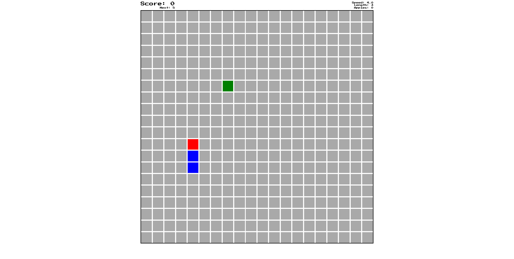

# Snake React Tsx

> Popular snake game written in React with Typescript.  
[Deployed game](https://snake-tsx.vercel.app/)



## Table of contents

- [General info](#general-info)
- [Technologies](#technologies)
- [Setup](#setup)
- [Status](#status)
- [Contact](#contact)

## General info

This is just Snake game popular from old Nokia phones written in React with Typescript for practice. You control snake by arrows on keyboard or by touch of specific part of your mobile screen. Eat green apples and watch out for black mines!

## Technologies

- HTML5
- Sass
- React 18
- Typescript 4.8
- Redux

## Features

- Original point system
- Real-time status bar
- Controllable by touch on mobile
- Multiple customizable settings: initial speed, speed multiplier, board size, starting length, walls etc.
- Saving high score and recent settings in local storage
- Escape keybinding
- Responsive board view
- New mines don't appear close to the snake's head

## Setup

If you do not have yarn installed, run the below command first:
```bash
npm install -g yarn
```

To run the game locally, paste command below into your terminal and click enter:
```bash
git clone https://github.com/ifmcjthenknczny/snake-tsx && cd snake-tsx && yarn install && yarn start
```

## License

This work is licensed under a [Creative Commons Attribution-NonCommercial 4.0 International License](https://creativecommons.org/licenses/by-nc/4.0/).

## Contact

Created purely by [Maciej Konieczny](https://github.com/ifmcjthenknczny).  
Project Link: [https://github.com/ifmcjthenknczny/snake-tsx](https://github.com/ifmcjthenknczny/snake-tsx)
